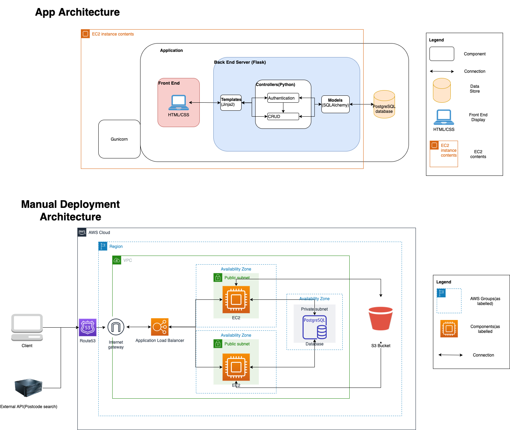
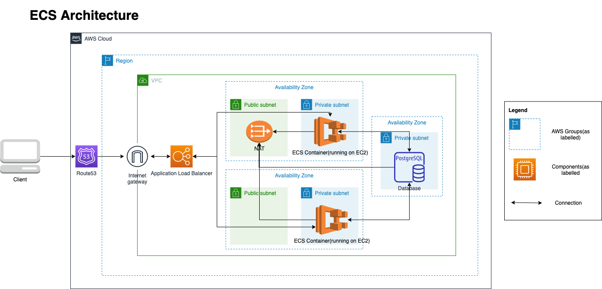

# Introduction
This is an AWS deployment exercise using a Flask application developed for one of my Coder Academy assessments. This repo acts as my own notes on how to deploy successfully using different methods attempted. Deployment was attempted using the following methods:-

## Manual deployment

This app was initially deployed manually using the following AWS architecture.


All components were set up on AWS manually such as:-

* Virtual Private Cloud - Public and Private subnets, internet gateway allowing the app to communicate externally with clients and external API.
* EC2 instances running the flask applications that communicates using with a database sitting in a private subnet using ORM.
* S3 bucket holding files that can be read/write through the flask application.
* Application Load Balancer to load balance two EC2 instances for availability and redundancy. The ALB has been configured to route all traffic through HTTPS for enhanced security.
* Route 53 for DNS resolution which allows for the ALB to be accessible via a domain name.


## ECR and ECS deployment
The following cloud architecture applies to the deployment using AWS Elastic Container Service (ECS).



Deployment using ECS requires manual set up of the following components:-

1. VPC - With public and private subnets in two separate Availability zones(for load balancing purposes), a third availability zone to house the private subnet for the database. All private subnets has egress traffic configured to go through the NAT gateway. 
2. ELB - An application load balancer set up connected to the public subnets in the availability zones that are to host the ECS containers and listeners routed directly to the containers (once they are set up). 
3. Setting up of DNS resolution with Route 53 and HTTPS for the ELB is similar to the steps taken in the manual deployment process.

Setting up ECS

1. Clone this repository.
2. Create image from cloned repo. [Dockerfile](Dockerfile) already written for buiding of docker image.
3. Push image to Elastic Container Repository(ECR).
4. Set up ECS task definition with the ECR image with EC2 launch type and awsvpc networking mode. Ensure container port mapping is set to port 8000. An env file can also be set to be pulled from an S3 bucket for container environment variables (Template can be found [here](src/.env.example)).
5. Create cluster and configure cluster networking to the VPC set up from the previous step and security group enabling inbound traffic through port 8000.
6. Define a service within the cluster for deployment of tasks as defined in Step 4 and select the load balancer created in Step 2 in the previous section.

CI/CD
In order to enable CICD to work as per this [CI/CD workflow](CICD/ci-cd-ECS.yml), the following environments and environment variables must be set within the GitHub repository.

1. Testing environment
```
Name: flask-testing
Variables:-
    FLASK_ENV=testing
    AWS_ACCESS_KEY_ID=<for user that has read + write permissions for test S3 bucket>
    AWS_SECRET_ACCESS_KEY=<for user that has read + write permissions for test S3 bucket>
    AWS_S3_BUCKET=<test S3 bucket>
```

2. Deployment environment
```
Name: flask-deploy
Variables:-
    AWS_ACCESS_KEY_ID=<AWS user that has permissions for ECR and ECS>
    AWS_SECRET_ACCESS_KEY=<AWS user that has permissions for ECR and ECS>
    AWS_SESSION_TOKEN=may or may not be required (required on AWS Starter accounts)
    AWS_ACCOUNT_ID=<12 digit aws account ID>
```

Once the above are set up and running correctly, this [CI/CD workflow](CICD/ci-cd-ECS.yml) can be used to do the following:-

1. Check code, run automated tests on push to GitHub.
2. Once step 1 is complete, create and push latest image onto ECR and deploy updated image through ECS.
**Note:** Ensure that the cluster name and service name on line 61 matches the ones that is set up in ECS.