# PART A-R1: Project description
**Web application:** MyLocale

**Purpose:** To host local community pages that act as a central community forum for residents and businesses.

**Functionality/features**
Minimum Viable Product (MVP) features include:-

1. Securely authenticate users upon login.
2. Allow users to create their own profile that requires them to select multiple locations of interest.
3. Give suggestions to new users (upon setting up their profile) about groups that are close to/in their local area
4. Give users the option to view/join multiple locale pages.
5. Allow users to create locale pages that are specific to a particular area.
6. Allow page creators to delete pages that they have created.
7. Allow page creators to regulate and remove posts within the pages that they have created.
8. Allow users to search group pages by area.
9. Allow page members to create posts in the page.
10. Allow page members to comment on posts in the page.
11. Allow post creators to update and and remove their own posts.

Additional feature(s) include:-
1. Allow user to manage their own accounts such as changing passwords and deleting their accounts (Added 15 Feb).

**Target audience:** MyLocale aim to serve as the preferred community board/forum for residents and businesses in their local area. It also serves non-residents as a secondary audience to enable them to find out more about a particular area.

**Tech stack:**

The tech stack that will be used for the MyLocale WebApp includes the following:-

1. Python's Flask Framework
2. PostgreSQL (Database)
3. Jinja2 templating language (View Templates)
4. HTML/CSS(Front End)
5. SQLAlchemy and Marshmallow (ORM, serialisation/deserialisation)
6. AWS Cloud Infrastructure (EC2, Elastic Load Balancer, AutoScaling, S3, VPC, Networking)

# PART A-R2: Dataflow diagram
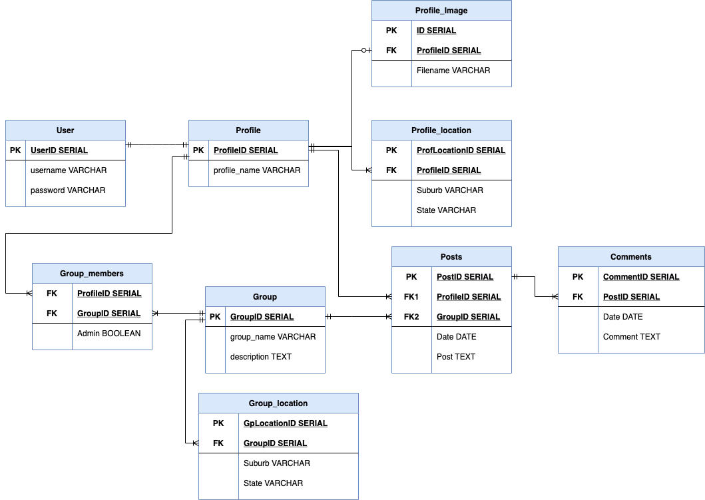

The data flow for MyLocale is represented in the above Data Flow diagram (DFD) using the Yourdon and Coad notation and broken up into three levels - Levels 0, 1 and 2.

Level 0 - This is a context diagram showing the data exchange between a user and the MyLocale app

Level 1 - This level breaks down the MyLocale app into 4 main processes, their associated data stores as well as the data flow between these processes, data stores and entities.

Level 2 - Level 2 further breaks down each of the main processes in MyLocale to illustrate the detailed data flow between the subprocesses for an in-depth illustration of data flow in the MyLocale app.

# PART A-R3: Application Architecture Diagram
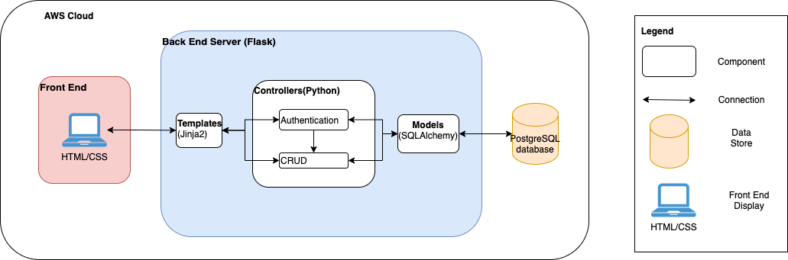

Above is the current architecture plan for the application which is a web application that consist of the following components:-

1. Front End - The front end of the application will be constructed in HTML and CSS guided by Jinja2 templates.
2. Back End Server - The back end server is constructed using Python's flask framework using the Model-View-Controller(MVC) pattern. 
3. Database - Data for this application will be stored on a PostgreSQL database that is connected to the controllers through the use of SQLAlchemy ORM models. 

It is envisioned that this application will be hosted on AWS cloud as a load-balanced and autoscaled application.

# PART A-R4: User Stories
## User Personas
This web application aims serve the needs of three different personas, primarily residents and local businesses and secondarily non-residents who are interested in a particular locale.

### Resident
* **Who:** This is a resident of the area(locale). This can range across the demographic of a particular locale 
* **Goal:** 

    1. Want a forum where they can easily view information and ask and/or answer questions relevant to their local area. 
    2. Want to be more aware of local business and services
    3. Want to leave feedback and recommendations for local businesses to help other local residents.
* **Issues:** Information about a local neighborhood is scattered on various forums across the internet with different demographics participating in different forums with different objectives. It makes it difficult for an individual who is unfamiliar with the available forums to decide which one(s) that will help them achieve their goal.

### Local Business/Service
* **Who:** A business/sole-trader/partnership offering products and services in the local area (locale).
* **Goal:** Want to bring awareness to their business/service to local residents and understand local perception of their business.
* **Issues:** Similar to the issues encountered by the 'Resident' persona, current local forums are scattered all over the internet making it difficult for a business/service to keep track of their footprint and reviews across their local customer base.

### Non-resident
* **Who:** Not a resident of the local area(locale) but someone who is interested in the locale such as someone researching a locale before moving in or someone travelling or staying short-term in the locale.
* **Goal:** Want to be able to ask questions for the purposes of research/planning before moving in/travelling to the locale.
* **Issues:** Scattered forums across the internet makes it a huge barrier for a non-local to get a holistic knowledge base about a locale.

## User Stories
| Persona      | User Stories                                                                                                                                                                                                                     |
|--------------|--------------------------------------------------------------------------------------------------------------------------------------------------------------------------------------------------------------------------------|
| Resident     | As a resident, I want to be able to easily participate in discussions about my local area so that I can share my knowledge with other fellow residents where I reside.                                                         |
| Resident     | As a resident, I want to be able to participate in discussions about my local area that covers the wide range of people who live in my area so that we can all benefit from the collective knowledge of fellow residents from all walks of life. |
| Resident     | As a resident, I want to be able to easily search for topics that have been discussed about the local area so that I am able to save time by viewing what has been discussed about a particular topic in my local area.        |
| Resident     | As a resident, I want to be able to easily ask questions about the local area so that I can get help/be better informed about my local area.                                                                                   |
| Resident     | As a resident, I want to be able to find out more about local businesses/services available in my local area so that I am aware and of what businesses/services are available close to where I reside.                     |
| Resident     | As a resident, I want to be able to leave reviews/recommend local businesses that I have patronised so that I can help potential customers to be informed about a particular business/service in my local area.                |
| Business     | As a local business, I want to be able to post about my business/services that I offer so that people are aware of my business/service in my local area.                                                                       |
| Business     | As a local business, I want to be able to get fair reviews about my business/services so that I may improve my business/service.                                                                                               |
| Business     | As a local business, I want to be able to respond to reviews and feedback because I want to be engaged with my local customer base.                                                                                            |
| Non-resident | As a non-resident, I want to be able to be able to view locale pages so that I can understand a locale better before moving in/visiting.                                                                                       |
| User | (Additional feature) As a user, I want to be able to manage my own account on MyLocale so that I can have better control over my account.                                                                                       |

# PART A-R5: Wireframes
Page wireframes shown as per logical project flow. Pages will be prioritised according to the order shown below.
## Registration and login pages
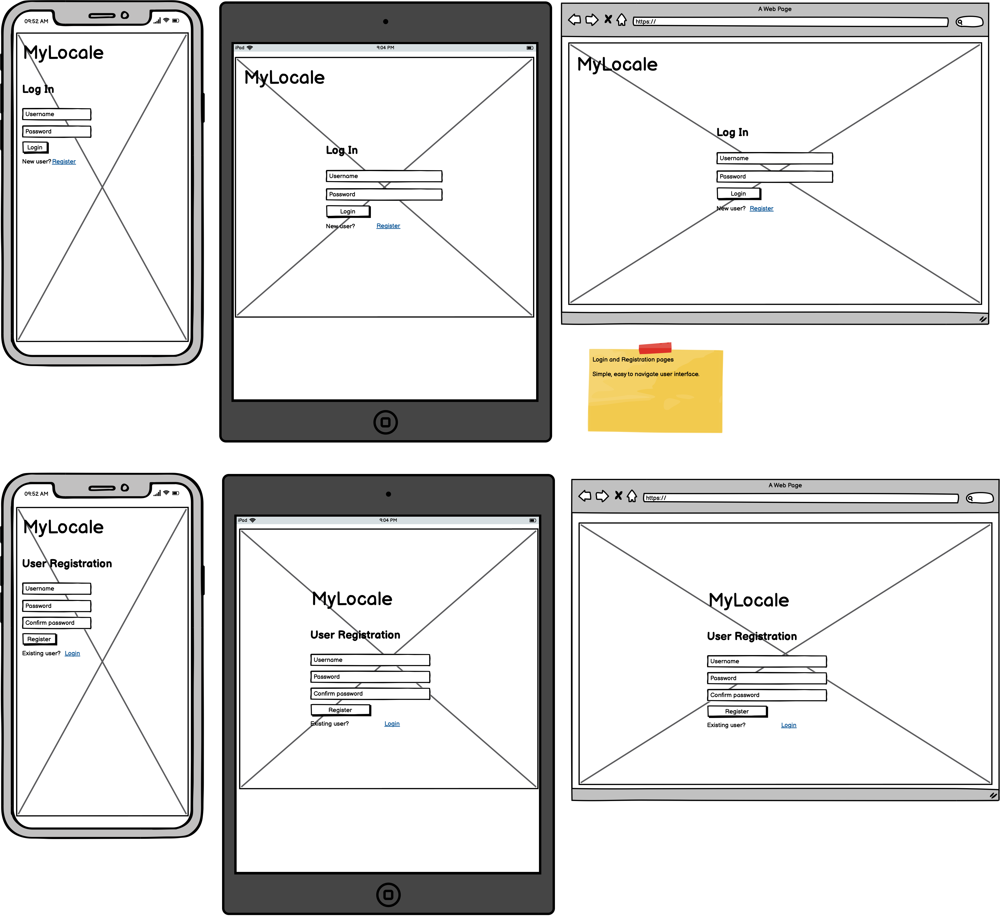
The login and registration pages will be created first as it is the starting point according to the data flow diagram and also play an important role in the back end for authentication and authorisation for other features in the app.

## Profile page
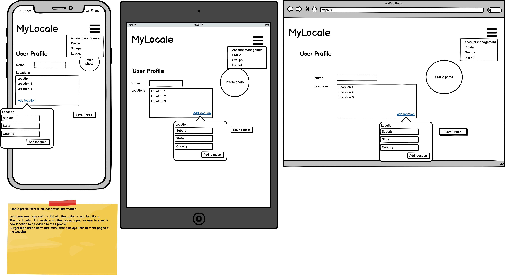
Next to be developed is the profile page due to profile data being linked to user data (one-to-one relationship) and also the crucial role of the profile location data to guide group recommendations.

## Groups page
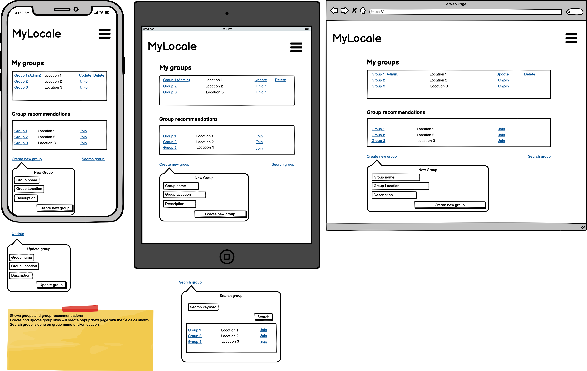
The group page will be developed after the profile page as it the next step in the data flow. 
This page lists groups categorised into 2 categories - Groups to which the user belongs to and group recommendations that the user can join. User also has the option to do a keyword search for groups and create new groups. Options displayed next to groups differ according to the group admin status of the user.

## Group detail page
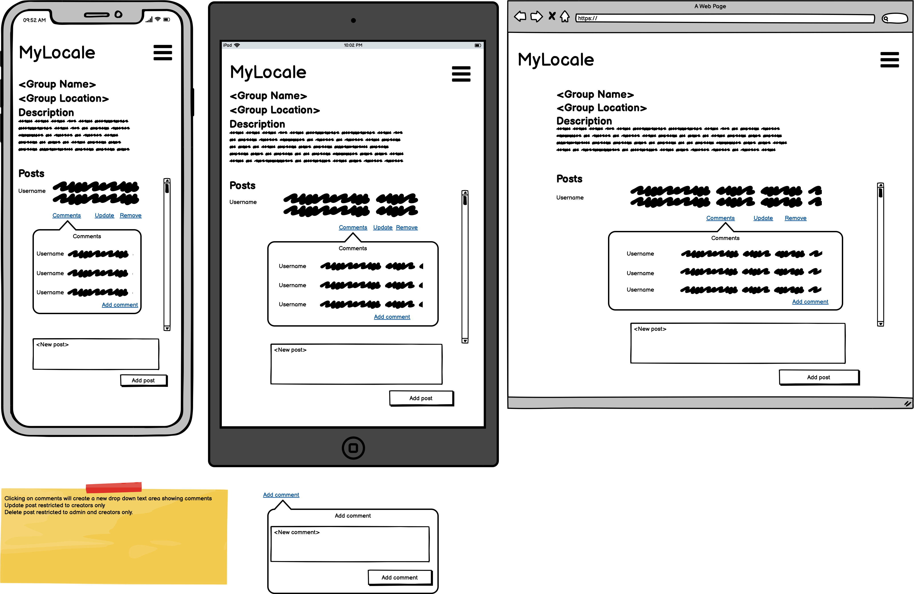
This page shows a group's information in more detail. Detailed information can be viewed by all users but only group members have the ability to create and comment on posts on a group page. Group admin also have the additional ability to remove posts.

## Account management page(additional feature)
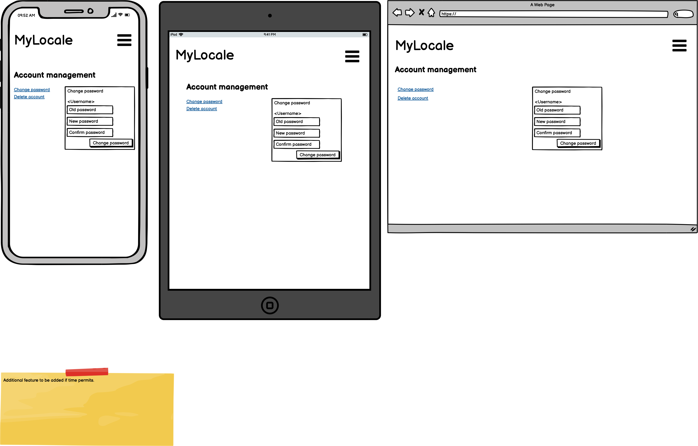
This page is an additional feature to be added if time permits to assist in the user being able to manage their own MyLocale account.

# PART A-R6: Project Management (Trello)
This project will follow the Agile Kanban framework with the aim of full transparency of work and developer capacity throughout the project. Due to the short timeframe allocated for the project, the Kanban framework was chosen due to the continuous flow of tasks rather than breaking up the project into fixed length sprints (such as in the Scrum framework) and placing the decision for feature deployment and project changes in the discretion of the developer.

This project is divided into two phases:-
1. **Project Planning and Setup** - The goal of this phase is to plan and adequately finalise the project specifications before the next phase. This includes planning, designing, and documenting the project specifications as well as setting up the development environment. **Due date: 21 Feb 2021**
2. **Project implementation** - This phase will include the coding, testing and deployment all the planned features of the web application to have the final product deployed to production. **Due date: 12 Mar 2021**

A [project trello board (live)](https://trello.com/b/awN6ojS8/t4a2) has been set up outlining the project workflow of both phases, manage and track tasks to ensure that they are completed as planned. The general workflow of the trello board is documented in the **About This Board** section. Columns are shown and collapsed throughout the project depending on where the active tasks are tracking throughout the board. 

The developer is responsible for updating task status and marking task completion as they are completed each day. Below are some screenshots of the trello board throughout the project and a short description of the project status that is being reflected.

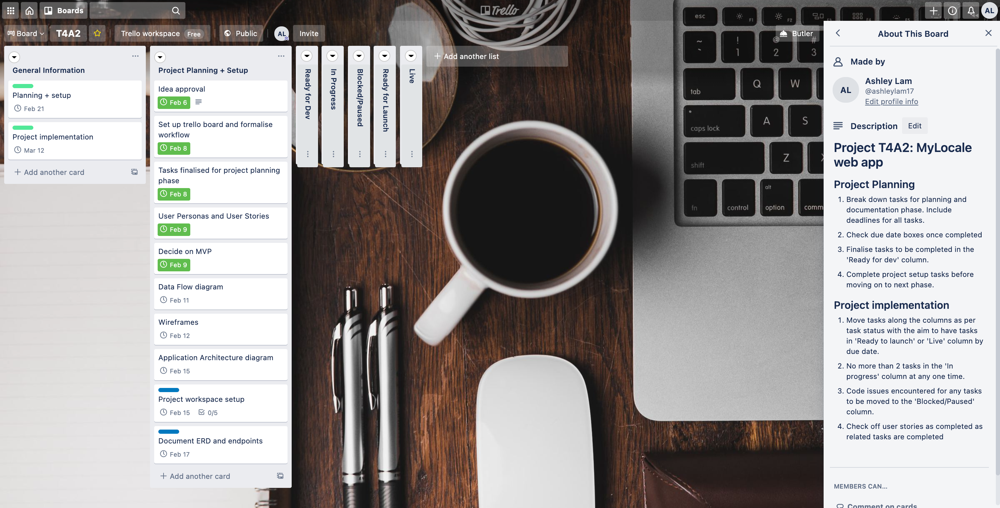
*February 8*: Trello board set up and workflow formalised; Tasks for project implementation and setup listed with due dates. Drafted user stories and mapped out MVP.

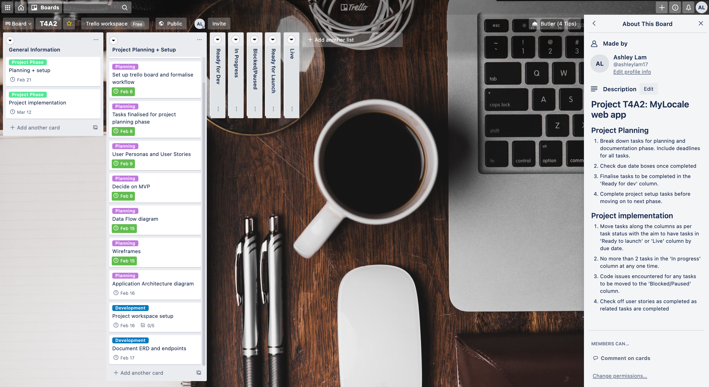
*February 15*: Completed DFD and Wireframes. Additional user story and feature added to [README](README.md).

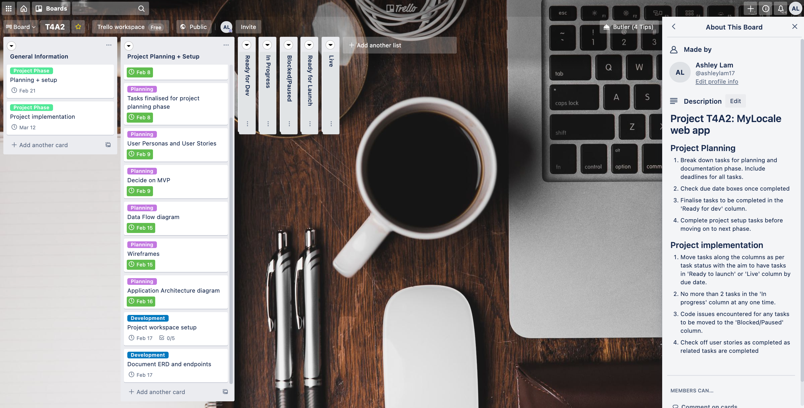
*February 16*: Completed AAD. Part A ready for submission.

# PART B DOCUMENTATION
## Entity Relationship Diagram(ERD)
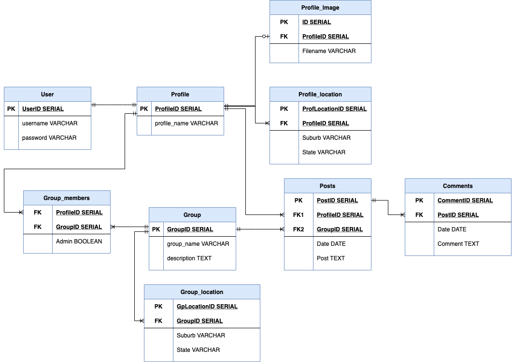

The above Entity Relationship Diagram(ERD) outlines the database structure that is set up for the MyLocale web application.

## Project Management (Trello)
This section is a continuation of the project tracking activity from PART A-R6. Below are the screenshots of the Trello board throughout the application development and deployment process.

## Deployment/Installation steps
### Continuous integration/Continuous Deployment(CI/CD)

**Continuous Integration(CI)**

The steps involved in the Continuous Integration(CI) workflow upon pushing onto GitHub:-
1. Checks out project from github into a virtual machine(VM) running on ubuntu-latest.
2. Installs Python3.8 on the VM
3. Installs dependencies as specified on requirements.txt
4. Run Automated tests
5. Checks code according to PEP8 style guide using flake8

**Continuous Deployment(CD)**
<!-- Pending deployment -->